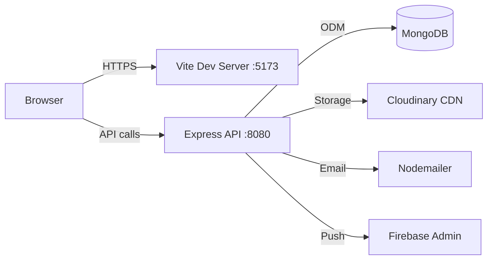

# AGENTS.md
This file provides guidance to Verdent when working with code in this repository.

## Table of Contents
1. Commonly Used Commands
2. High-Level Architecture & Structure
3. Key Rules & Constraints
4. Development Hints

## Commands
- **Install all dependencies**: `npm install` (root installs client via postinstall)
- **Run frontend (dev)**: `npm run dev` or `npm --prefix client-react run dev` (port 5173)
- **Run backend (dev)**: `npm --prefix server run dev` (port 8080, uses nodemon)
- **Build frontend**: `npm run build`
- **Start backend (prod)**: `npm --prefix server run start`
- **No formal test/lint commands configured** [inferred]

## Architecture
### Subsystems
- **client-react/**: React 18 + Vite frontend with Redux Toolkit, Ant Design, Tailwind CSS
- **server/**: Express.js 5 + MongoDB backend with JWT auth (HTTP-only cookies)

### Request/Response Flow

### Backend Structure (`server/`)
- `index.js` - Entry point
- `config/` - DB connection, Firebase, Email setup
- `controllers/` - Business logic (auth, client, user, admin, ai)
- `models/` - Mongoose schemas (User, Client, Procurement, ProductCompliance, etc.)
- `routes/` - API route definitions (auth, client, user, admin, ai)
- `middleware/` - auth.js (JWT verification), upload.js (Multer), rateLimiter.js
- `cron/` - Scheduled tasks (auditCron.js)

### Frontend Structure (`client-react/src/`)
- `App.jsx` - Main routing
- `components/` - Reusable UI (DashboardLayout, PrivateRoute)
- `pages/` - Views (Auth, Dashboard, Client Management, PlantProcess)
- `store/` - Redux slices

### External Dependencies
- **MongoDB**: Primary database (configured via MONGO_URI or MONGODB_URI env var)
- **Cloudinary**: Document/image storage
- **Firebase Admin**: Push notifications
- **Nodemailer**: Email via Gmail (requires App Password)

## Key Rules & Constraints
- JWT tokens stored in HTTP-only cookies (not localStorage)
- Authentication middleware at `server/middleware/auth.js` protects routes
- Role-based access: USER (own clients) vs ADMIN (full access)
- File uploads: PDF, DOC, DOCX, XLS, XLSX, JPG, JPEG, PNG; max 10MB
- OTP expires in 10 minutes
- Access token expires in 6h, refresh token in 7d
- Environment variables required in `server/.env`: PORT, FRONTEND_URL, MONGODB_URI, SECRET_KEY_ACCESS_TOKEN, SECRET_KEY_REFRESH_TOKEN, MAIL_USER, MAIL_PASS
- Backend uses ES Modules (`"type": "module"`)

## Development Hints

### Adding a New API Endpoint
1. Create or update controller in `server/controllers/`
2. Define route in `server/routes/`, import controller function
3. Register route in `server/index.js` if new route file
4. Apply `auth` middleware for protected endpoints
5. Use `upload` middleware for file uploads

### Adding a New Frontend Page
1. Create page component in `client-react/src/pages/`
2. Add route in `client-react/src/App.jsx`
3. Wrap with `PrivateRoute` if authentication required
4. Use Redux slices from `store/` for global state
5. Use Ant Design components for consistency

### Excel Import/Export
- Backend uses `xlsx` library in controllers
- Frontend also has `xlsx` for client-side parsing
- See PlantProcess for bulk procurement import example

### Deployment
- Vercel configured for frontend (`vercel.json` present)
- Backend typically deployed separately (set FRONTEND_URL for CORS)
