# EPR KAVACH Architecture Diagram

## Table of Contents
1. [High-Level Architecture](#high-level-architecture)
2. [Frontend Architecture](#frontend-architecture)
3. [Backend Architecture](#backend-architecture)
4. [Database Schema](#database-schema)
5. [API Flow](#api-flow)
6. [User Workflow](#user-workflow)
7. [Security Architecture](#security-architecture)

---

## High-Level Architecture

```mermaid
flowchart TB
    subgraph Users ["Users & Clients"]
        direction TB
        Admin[("👤 Admin")]
        User[("👤 Users")]
        Client[("🏢 Clients")]
    end

    subgraph Frontend ["Frontend (React 18 + Vite)"]
        direction TB
        WebApp[("🌐 Web Application")]
        
        subgraph FrontendLayers ["Frontend Components"]
            direction LR
            UI["🎨 UI Layer<br/>(Ant Design + Tailwind)"]
            State["📦 State Management<br/>(Redux Toolkit)"]
            Router["🔀 Routing<br/>(React Router)"]
            API["🌐 API Client<br/>(Axios)"]
        end
        
        subgraph Pages ["Pages"]
            direction TB
            AuthPages["Login/Register<br/>ForgotPassword"]
            Dashboard["Dashboard<br/>KPIDashboard"]
            ClientPages["Clients<br/>AddClient<br/>EditClient<br/>ViewClient"]
            AuditPages["ClientAudit<br/>ClientValidation"]
            ProcessPages["PlantProcess<br/>ProductCompliance"]
            AdminPages["AdminPanel<br/>CompanyManagement"]
        end
        
        WebApp --> FrontendLayers
        FrontendLayers --> Pages
    end

    subgraph Backend ["Backend (Express.js 5)"]
        direction TB
        ExpressServer[("⚡ Express Server")]
        
        subgraph Middleware ["Middleware"]
            direction LR
            AuthMW["🔐 Auth Middleware<br/>(JWT Verification)"]
            UploadMW["📤 Upload Middleware<br/>(Multer)"]
            RateMW["🛡️ Rate Limiter"]
            ValidateMW["✅ Input Validation"]
        end
        
        subgraph Controllers ["Controllers"]
            direction TB
            AuthCtrl["Auth Controller<br/>(Login/Register/OTP)"]
            ClientCtrl["Client Controller<br/>(CRUD Operations)"]
            UserCtrl["User Controller<br/>(User Management)"]
            AdminCtrl["Admin Controller<br/>(Admin Functions)"]
            AICtrl["AI Controller<br/>(Smart Analysis)"]
        end
        
        subgraph Routes ["Routes"]
            direction LR
            AuthRoute["/api/auth"]
            ClientRoute["/api/client"]
            UserRoute["/api/user"]
            AdminRoute["/api/admin"]
            AIRoute["/api/ai"]
        end
        
        ExpressServer --> Middleware
        Middleware --> Controllers
        Controllers --> Routes
    end

    subgraph Database ["Database (MongoDB)"]
        direction TB
        MongoDB[("🗄️ MongoDB")]
        
        subgraph Models ["Mongoose Models"]
            direction LR
            UserModel["User Model"]
            ClientModel["Client Model"]
            ProcurementModel["Procurement Model"]
            ComplianceModel["ProductCompliance Model"]
            SKUGModel["SKUCompliance Model"]
            SUPModel["SingleUsePlastic Model"]
            PWPModel["PWP Model"]
            LoginLogModel["LoginLog Model"]
        end
    end

    subgraph ExternalServices ["External Services"]
        direction TB
        Cloudinary[("☁️ Cloudinary<br/>(File Storage)")]
        Firebase[("🔥 Firebase Admin<br/>(Push Notifications)")]
        Email[("📧 Email Service<br/>(Nodemailer/Gmail)")]
    end

    %% Connections
    Users -- HTTPS --> WebApp
    WebApp -- REST API --> ExpressServer
    ExpressServer -- ODM --> MongoDB
    ExpressServer -- File Upload --> Cloudinary
    ExpressServer -- Email --> Email
    ExpressServer -- Push --> Firebase

    %% Styling
    classDef users fill:#ffeb3b,stroke:#f57f17,stroke-width:2px
    classDef frontend fill:#e3f2fd,stroke:#1565c0,stroke-width:2px
    classDef backend fill:#fff3e0,stroke:#e65100,stroke-width:2px
    classDef database fill:#e8f5e9,stroke:#1b5e20,stroke-width:2px
    classDef external fill:#f3e5f5,stroke:#4a148c,stroke-width:2px
    
    class Admin,User,Client users
    class WebApp,UI,State,Router,API,AuthPages,Dashboard,ClientPages,AuditPages,ProcessPages,AdminPages frontend
    class ExpressServer,AuthMW,UploadMW,RateMW,ValidateMW,AuthCtrl,ClientCtrl,UserCtrl,AdminCtrl,AICtrl,AuthRoute,ClientRoute,UserRoute,AdminRoute,AIRoute backend
    class MongoDB,UserModel,ClientModel,ProcurementModel,ComplianceModel,SKUGModel,SUPModel,PWPModel,LoginLogModel database
    class Cloudinary,Firebase,Email external
```

---

## Frontend Architecture

```mermaid
flowchart TB
    subgraph App ["App.jsx"]
        Router["React Router<br/>└── Routes"]
    end
    
    subgraph Layouts ["Layouts"]
        DashboardLayout["DashboardLayout<br/>├── Sidebar<br/>├── Header<br/>└── Content"]
    end
    
    subgraph Components ["Components"]
        subgraph Shared ["Shared Components"]
            PrivateRoute["PrivateRoute"]
            Pagination["Pagination"]
            Sidebar["Sidebar"]
            AuditStepper["AuditStepper"]
        end
        
        subgraph AddClientSteps ["AddClientSteps"]
            PreValidation["PreValidation"]
            ClientBasicInfo["ClientBasicInfo"]
            CompanyAddress["CompanyAddress"]
            CompanyDocument["CompanyDocument"]
            CteCtoCca["CteCtoCca"]
            Audit["Audit"]
            PostAuditCheck["PostAuditCheck"]
        end
        
        subgraph PlantProcessSteps ["PlantProcessSteps"]
            ConsentVerification["ConsentVerification"]
            ProductCompliance["ProductCompliance"]
            SingleUsePlastic["SingleUsePlastic"]
            SummaryReport["SummaryReport"]
        end
    end
    
    subgraph Pages ["Pages"]
        subgraph Auth ["Auth Pages"]
            Login["Login"]
            Register["Register"]
            ForgotPassword["ForgotPassword"]
        end
        
        subgraph ClientMgmt ["Client Management"]
            Clients["Clients"]
            AddClient["AddClient"]
            ViewClient["ViewClient"]
            EditClient["EditClient"]
            ClientDetail["ClientDetail"]
            ClientGroupSearch["ClientGroupSearch"]
        end
        
        subgraph Audit ["Audit Pages"]
            ClientAudit["ClientAudit"]
            ClientValidation["ClientValidation"]
            ValidatedClients["ValidatedClients"]
        end
        
        subgraph Process ["Process Pages"]
            PlantProcess["PlantProcess"]
            EWasteCategorySelection["EWasteCategorySelection"]
            WasteTypeSelection["WasteTypeSelection"]
            ClientTypeSelection["ClientTypeSelection"]
        end
        
        subgraph Admin ["Admin Pages"]
            AdminPanel["AdminPanel"]
            CompanyManagement["CompanyManagement"]
            KPIDashboard["KPIDashboard"]
            LoginLogs["LoginLogs"]
        end
        
        subgraph Dashboard ["Dashboard"]
            DashboardHome["DashboardHome"]
            DocumentViewer["DocumentViewer"]
        end
    end
    
    subgraph State ["State Management"]
        AuthSlice["Auth Slice"]
        Store["Redux Store"]
    end
    
    subgraph Services ["Services"]
        API["API Service"]
        APIEndpoints["API Endpoints"]
    end
    
    subgraph Context ["Context"]
        AuthContext["AuthContext"]
        ClientContext["ClientContext"]
    end
    
    App --> Router
    Router --> Layouts
    Router --> Pages
    Router --> Auth
    Router --> ClientMgmt
    Router --> Audit
    Router --> Process
    Router --> Admin
    Router --> Dashboard
    
    Pages --> Components
    Components --> Shared
    Components --> AddClientSteps
    Components --> PlantProcessSteps
    
    State --> Store
    Store --> AuthSlice
    Services --> API
    Services --> APIEndpoints
    Context --> AuthContext
    Context --> ClientContext
```

---

## Backend Architecture

---

## Database Schema

---

## API Flow

```mermaid
flowchart LR
    subgraph Client ["Client (Browser)"]
        Browser["🌐 Browser<br/>(React App)"]
    end
    
    subgraph API ["API Gateway"]
        Express["⚡ Express Server"]
    end
    
    subgraph Auth ["Authentication"]
        JWT["🔐 JWT Tokens<br/>(Access + Refresh)"]
        Cookie["🍪 HTTP-Only Cookies"]
    end
    
    subgraph Routes ["API Routes"]
        subgraph AuthRoutes ["Auth Routes"]
            POSTAuth["POST /api/auth/login<br/>POST /api/auth/register<br/>POST /api/auth/logout<br/>POST /api/auth/verify-otp"]
        end
        
        subgraph ClientRoutes ["Client Routes"]
            GETClient["GET /api/client<br/>GET /api/client/:id<br/>POST /api/client<br/>PUT /api/client/:id<br/>DELETE /api/client/:id"]
        end
        
        subgraph UserRoutes ["User Routes"]
            GETUser["GET /api/user<br/>POST /api/user<br/>PUT /api/user/:id"]
        end
        
        subgraph AdminRoutes ["Admin Routes"]
            GETAdmin["GET /api/admin/users<br/>PUT /api/admin/approve<br/>GET /api/admin/stats"]
        end
        
        subgraph AIRoutes ["AI Routes"]
            POSTAI["POST /api/ai/analyze<br/>POST /api/ai/compliance-check"]
        end
    end
    
    subgraph Database ["Database"]
        MongoDB["🗄️ MongoDB"]
    end
    
    Browser -- HTTPS --> Express
    Express --> Auth
    Auth --> Cookie
    Express --> AuthRoutes
    Express --> ClientRoutes
    Express --> UserRoutes
    Express --> AdminRoutes
    Express --> AIRoutes
    Express --> MongoDB
    
    classDef api fill:#e3f2fd,stroke:#1565c0
    classDef auth fill:#fff3e0,stroke:#e65100
    classDef route fill:#e8f5e9,stroke:#1b5e20
    
    class Browser,Express,JWT,Cookie api
    class Auth auth
    class AuthRoutes,ClientRoutes,UserRoutes,AdminRoutes,AIRoutes route
```

---

## User Workflow

---

## Security Architecture

```mermaid
flowchart TB
    subgraph SecurityLayers ["Security Layers"]
        
        subgraph Layer1 ["Layer 1: Network Security"]
            CORS["🌐 CORS Configuration<br/>- Allowed Origins<br/>- HTTP Methods<br/>- Headers"]
            RateLimit["🛡️ Rate Limiting<br/>- API Protection<br/>- DoS Prevention"]
            SSL["🔒 SSL/TLS<br/>- HTTPS Only<br/>- Certificate"]
        end
        
        subgraph Layer2 ["Layer 2: Authentication"]
            JWT["🔐 JWT Tokens<br/>- Access Token (6h expiry)<br/>- Refresh Token (7d expiry)"]
            Cookie["🍪 HTTP-Only Cookies<br/>- XSS Protection<br/>- Secure Flag"]
            OTP["📱 OTP Verification<br/>- 10 minute expiry<br/>- Email/SMS"]
        end
        
        subgraph Layer3 ["Layer 3: Authorization"]
            RBAC["👥 Role-Based Access<br/>- Admin (Full Access)<br/>- User (Limited)<br/>- Client (Read Only)"]
            Middleware["🔒 Auth Middleware<br/>- Token Verification<br/>- Role Check"]
        end
        
        subgraph Layer4 ["Layer 4: Data Security"]
            Validation["✅ Input Validation<br/>- Server-side<br/>- Sanitization"]
            Encryption["🔢 Encryption<br/>- Password Hashing<br/>- Sensitive Data"]
            UploadSec["📤 File Upload Security<br/>- Type Validation<br/>- Size Limit (10MB)<br/>- Malware Scan"]
        end
        
        subgraph Layer5 ["Layer 5: Infrastructure"]
            Firewall["🧱 Firewall<br/>- Cloud Protection<br/>- IP Filtering"]
            Backup["💾 Backup & Recovery<br/>- Daily Backups<br/>- Geo-redundant"]
            Monitor["📊 Monitoring<br/>- Log Analysis<br/>- Anomaly Detection"]
        end
    end
    
    classDef layer1 fill:#ffebee,stroke:#c62828
    classDef layer2 fill:#fff3e0,stroke:#ef6c00
    classDef layer3 fill:#e8f5e9,stroke:#2e7d32
    classDef layer4 fill:#e3f2fd,stroke:#1565c0
    classDef layer5 fill:#f3e5f5,stroke:#7b1fa2
    
    class CORS,RateLimit,SSL layer1
    class JWT,Cookie,OTP layer2
    class RBAC,Middleware layer3
    class Validation,Encryption,UploadSec layer4
    class Firewall,Backup,Monitor layer5
```

---

## Technology Stack

```mermaid
flowchart TB
    subgraph Frontend ["Frontend Technologies"]
        direction TB
        F1["⚛️ React 18"]
        F2["🚀 Vite"]
        F3["📦 Redux Toolkit"]
        F4["🔀 React Router"]
        F5["🎨 Ant Design"]
        F6["🌊 Tailwind CSS"]
        F7["🌐 Axios"]
    end
    
    subgraph Backend ["Backend Technologies"]
        direction TB
        B1["🟢 Node.js"]
        B2["⚡ Express.js 5"]
        B3["🗄️ MongoDB"]
        B4["📋 Mongoose"]
        B5["🔐 JWT"]
        B6["📧 Nodemailer"]
        B7["📤 Multer"]
        B8["☁️ Cloudinary"]
    end
    
    subgraph DevOps ["DevOps & Tools"]
        direction TB
        D1["📝 Git"]
        D2["📦 npm/yarn"]
        D3["🔄 nodemon"]
    end
    
    classDef tech fill:#e3f2fd,stroke:#1976d2
    class F1,F2,F3,F4,F5,F6,F7 tech
    class B1,B2,B3,B4,B5,B6,B7,B8 tech
    class D1,D2,D3 tech
```

---

## Data Flow Diagram

---

## Key Files Reference

### Frontend Key Files
- [`client-react/src/App.jsx`](client-react/src/App.jsx) - Main routing
- [`client-react/src/pages/`](client-react/src/pages/) - Page components
- [`client-react/src/components/`](client-react/src/components/) - Reusable components
- [`client-react/src/store/`](client-react/src/store/) - Redux store
- [`client-react/src/services/api.js`](client-react/src/services/api.js) - API service

### Backend Key Files
- [`server/index.js`](server/index.js) - Entry point
- [`server/controllers/`](server/controllers/) - Business logic
- [`server/models/`](server/models/) - Database schemas
- [`server/routes/`](server/routes/) - API routes
- [`server/middleware/auth.js`](server/middleware/auth.js) - Authentication middleware

---

## Environment Variables

---

*Last Updated: February 2025*
*Project: EPR KAVACH - Environmental Compliance Management System*
